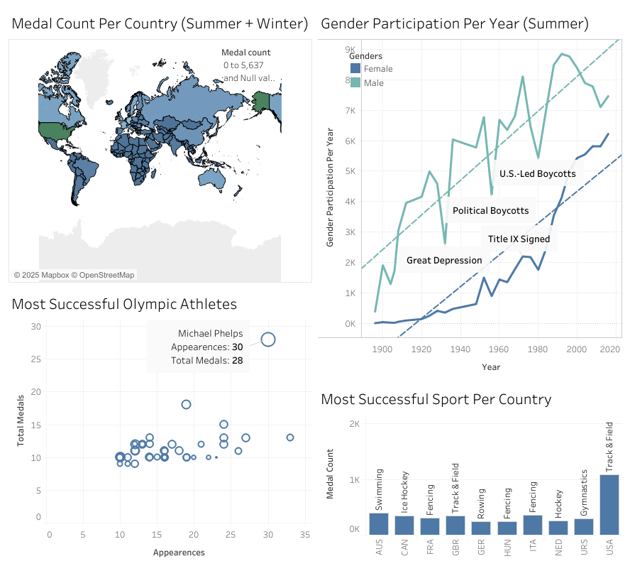

# Olympic Data Analysis Dashboard

## 📊 Project Overview
An end-to-end data analysis project exploring Olympic athlete data. This project involves data extraction, SQL querying, analysis in Python, and interactive dashboard creation using Tableau.

## 🛠️ Tools Used
- SQL
- Tableau

## 📂 Project Structure
- `data/`: Contains raw and processed data files
- `notebooks/`: Main analysis in Python
- `sql/`: SQL scripts for data extraction
- `tableau/`: Tableau dashboard (.twbx) and screenshots
- `images/`: Visualizations and charts

## 🔍 Key Insights
- Highlight a few main takeaways from your analysis (medal trends, country performance, athlete demographics, etc.)

## 📌 Dashboard Preview

## 🚀 How to Run
1. Clone the repo
2. Open the Jupyter notebook to review the analysis
3. Open the Tableau file to interact with the dashboard (requires Tableau)

## 📁 Data Source
- [Kaggle: Olympic History Dataset](link to the dataset)
